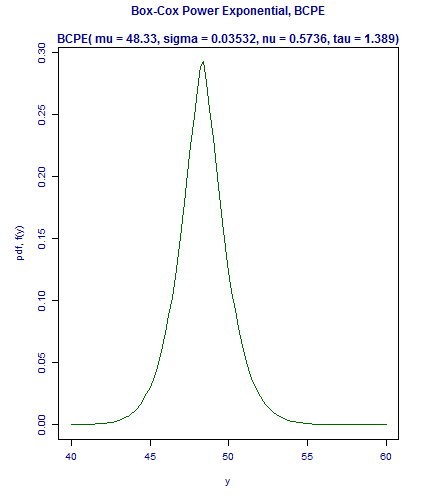
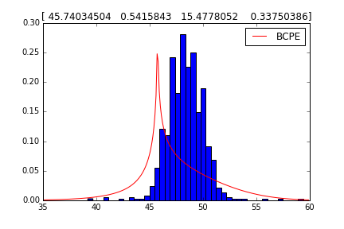
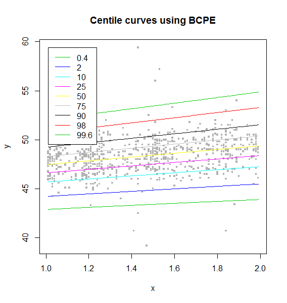

# gamlss
In this repository, I would like to convert the gamlss package from R to Python.

# 1D fitting
1D fitting of the Box-Cox Power exponential distribution (BCPE) in gamlss/R results in following graph:

script here: [code](1D/BCPE/gamlss_BCPE_fitting.R)

In python it looks like the following:

script here: [code](1D/BCPE/gamlss_BCPE_fitting.py)

# 2D fitting
Currently, I am still working at the implementation of 2D fitting.
Following graph shows the fitting results in gamlss/R:

script here: [code](2D/BCPE/percentiles_BCPE.R)
